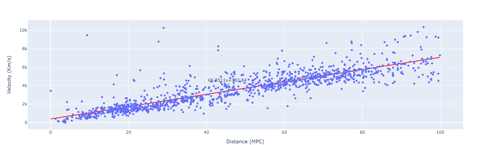

# Calculating the Hubble Constant from NED-D

The NED-D database contains redshifts and redshift-independent distances for extra galactic objects.  It is possible to use these values to repeat Hubble's experiment and plot distance vs velocity.  The slope of this line is the Hubble constant, measured in km/s/Mpc.  i.e. The further away these objects are, the faster they are moving away from us.  This is due to the expansion of the universe.

There are 2 different approaches to getting the data here.  The rest of the script is about plotting the points, generating a line slope and showing it.

## Using NED + NED_D
Notebook [hubble_constant](hubble_constant.ipynb) has a list of the original objects Hubble used and queries the NED database for their velocities.  This has the advantage that it locates the correct name for a second lookup in the sanitized NED-D.csv data (not accessible as an online database).  This csv file contains the distances which are searched and sorted by error.  The smallest error value is chosen.

Here is the result using just Hubble's objects (minus 2 that I could not locate):

Here is the result using NGC_0 -> NGC_9999

My result is around ~67 Km/s/Mpc which is pretty close to the current estimate of 73.

## Using NED_D
It is also possible to use just the NED_D redshift and calculate the velocity for low redshift values using v = z * c.  Adam, a fellow student did it this way first; my version of this approach is in [hubble_constant_ned_d](hubble_constant_ned_d.ipynb)

